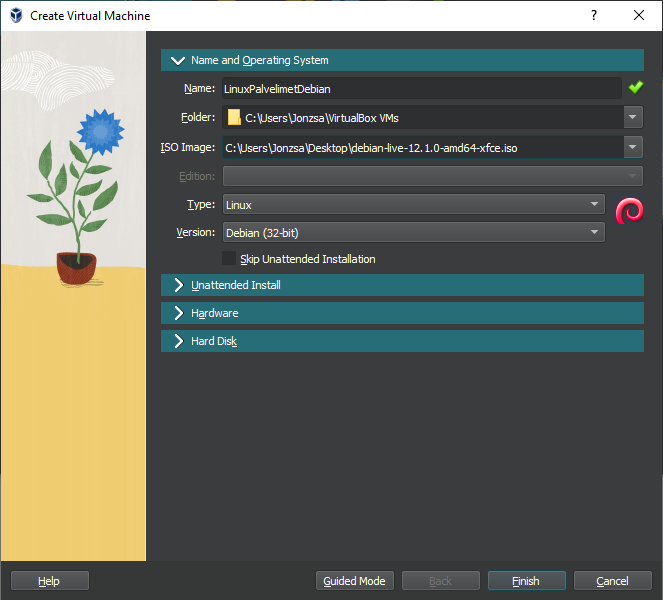
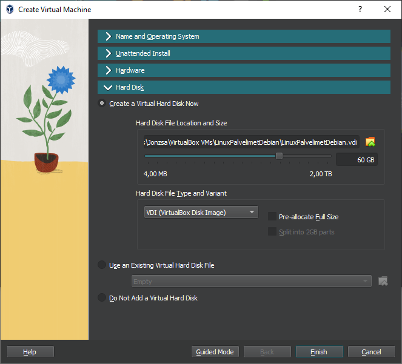
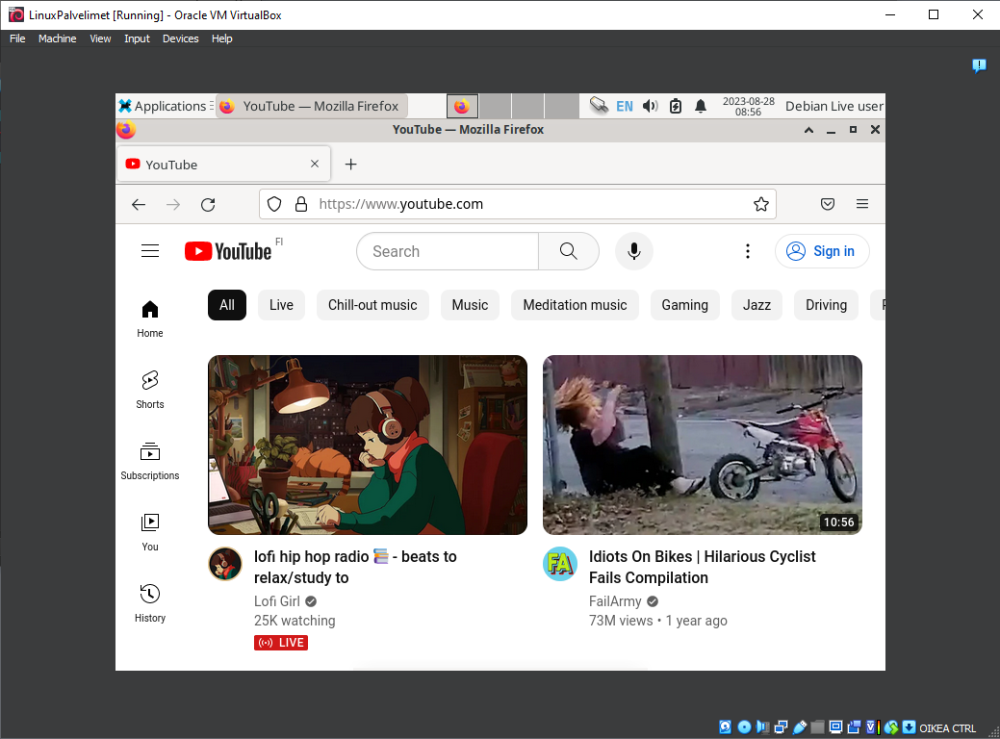
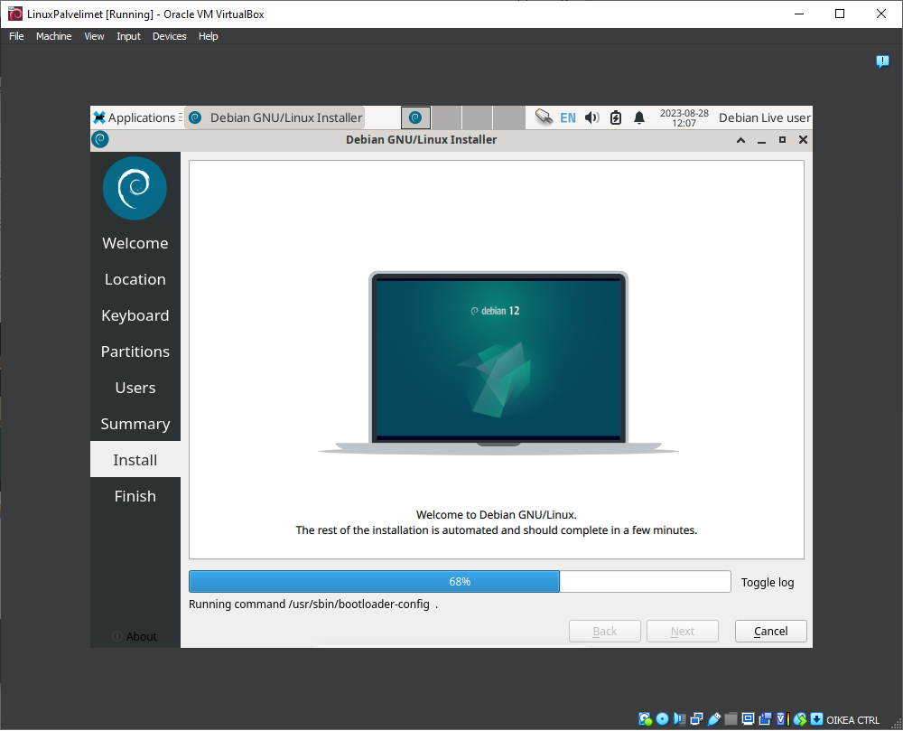
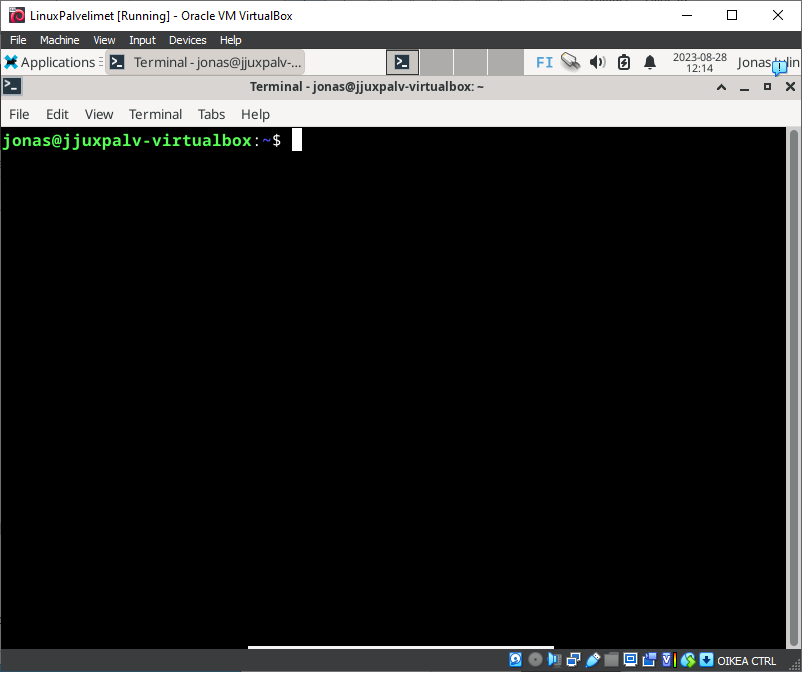
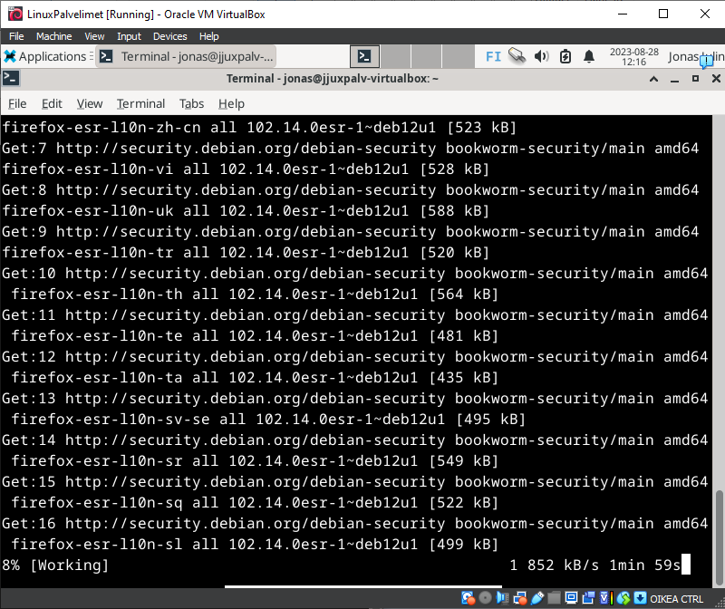
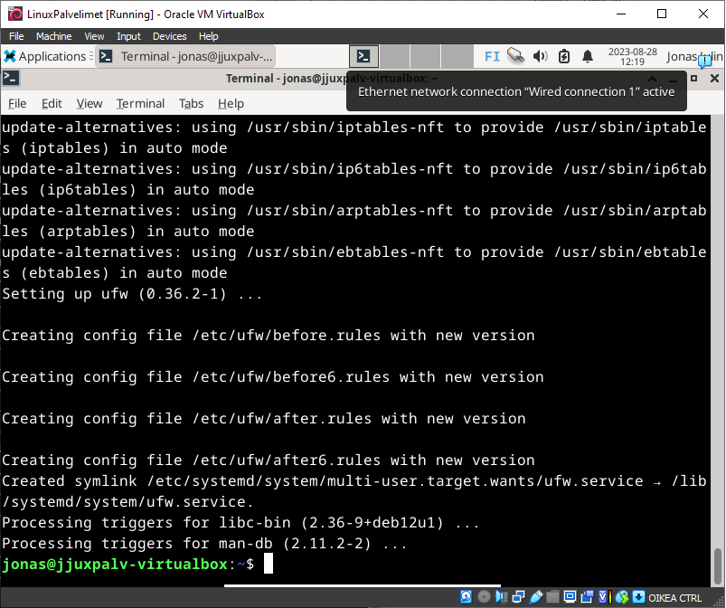

# h1 - linux palvelimet
## x) Artikkeleiden tiivisteet
ensimmäinen artikkeli
- (virhe)raporttien kirjoituksesta
- ohjeita mitä kannattaa/ei kannata tehdä raportin kirjoittamisessa

toinen artikkeli
- free software definition (vapaa ohjelma, ei välttämättä ilmainen ohjelma)
- neljä pilaria jotka määrittelee 
- vapaa ohjelma pitää olla liiketoiminnallinen

## a) Linux Vbox installointi
 Aluksi installoin uuden virtualboxin. Seurasin Tero Karvisen ohjeita (https://terokarvinen.com/2021/install-debian-on-virtualbox/)

 
 
 Valitsin Expert moden, kuten ohjeissa kerrottiin. Ohjeiden mukaisesti menin eteenpäin, huomasin tosin että ei löytynyt "dynamically allocate" kohtaa massamuistia tehdessä
 
 
 
 Jatkoin ohjeiden mukaan, näppäimistö, hiiri ja internet toimivat
 
 
 
 Jatkoin debianin installoimiseen, jossa meni viitisen minuuttia.
 
 
 
 Debianin installoimisen jälkeen, ruutu oli musta hetken ajan kunnes pääsin login näkymään.
 Avasin terminaalin, johon kirjoitin sudo apt-get update, jonka jälkeen kirjoitin sudo apt-get -y dist-upgrade.
 Terminaalin päivitysten jälkeen, asensin vielä palomuurin.
 
 
 
 

## Lähteet
https://terokarvinen.com/2006/raportin-kirjoittaminen-4/
https://www.gnu.org/philosophy/free-sw.html
https://terokarvinen.com/2021/install-debian-on-virtualbox/
https://terokarvinen.com/2023/create-a-web-page-using-github/
