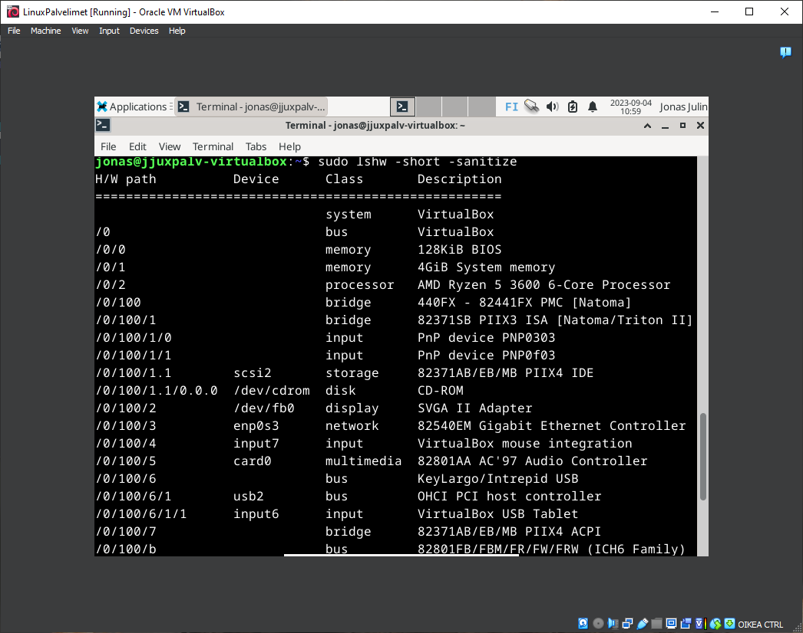

# h2 - Linux Palvelimet

## x) Artikkelin tiivistelmä

- artikkelissa käydään läpi komentoja
- artikkelissa on komentoja mm. tiedostojen läpikäymiseen, muokkaamiseen
- artikkeli myös antaa ohjeita ja vinkkejä, esimerkiksi  tärkeistä kansioista ja miten asennetaan ohjelmia terminaalin avulla.

lähde: https://terokarvinen.com/2020/command-line-basics-revisited/?fromSearch=command%20line%20basics%20revisited

## a) Googlasin miten asennetaan Micro, ja tapoja oli erilaisia.

Valitsin snap tavan, eli ensin pitää asentaa snap.
Asennetaan snap:

 
 
Ohjeen mukaisesti piti varmistaa että snap oli oikein asennettu, avasin koneen uusiksi.
Toimintaohjeiden mukaisesti, kirjoitin seuraavan komennon asentaakseni micron

 

Asennukseen meni muutama minuutti näennäisesti..

Ohjeen mukaan piti kirjoittaa micro avatakseni editorin, mutta ei auennut. Koitin APT asennusta seuraavaksi.

APT asennus toimi, komento micro avasi tekstieditorin!

lähde: https://techviewleo.com/install-and-use-micro-text-editor-on-ubuntu-debian/

## b) Seuraavaksi raudan analyysi. 
Annetaan komento 'sudo lshw -short -sanitize' tehtävän mukaisesti.
lshw komentoa ei löydetty:

lshw asennettu, koitetaan komentoa uusiksi ja listaus tulee esiin:

Kyseinen listaus antaa siis virtuaalikoneen raudan ominaisuudet, mm. mitä siihen on kytketty.
Huomaa, miten virtuaalikoneen geneeriset osat ovat mitä tehtiin asennuksessa, kuten 4 GiB system memory, mutta virtuaalikone kuitenkin myös käyttää oman koneeni prosessoria kuten omanaan (AMD Ryzen 5). 
Jotkut asiat virtuaalikone siis listaa kuten olisi oma tietokoneensa, mutta käyttää oikeaa rautaa myös toimiakseen.

lähde: https://terokarvinen.com/2023/linux-palvelimet-2023-alkusyksy/

## c) APT
Asennetaan kolme uutta komentoriviohjelmaa. Tehdään komentorivi joka asentaa kaikki kolme kerralla:

Kokeillaan jokaista uutta ohjelmaa. 

Googler:

Htop:

nnn:

lähteet: https://www.linuxlinks.com/100-awesome-must-have-tui-linux-apps/ & https://linuxhint.com/use-apt-to-install-multiple-programs-from-command-line-debian/

## d) FHS
Katsotaan ensin missä ollaan pwd komennolla. Ollaan käyttäjän kansiossa, eli /home/jonas.

Voidaan mennä ylös home kansioon kirjoittamalla cd .., ja takaisin esimerkiksi cd /home/jonas.

cd komennolla pääsemme kulkemaan kansiosta toiseen, kuten tässä vaikka /etc/ kansioon. Siinä on koneen asetuksia.

## e) Grep 
Käytin samaa esimerkkiä kuin tässä sivussa: https://www.freecodecamp.org/news/grep-command-in-linux-usage-options-and-syntax-examples/

grep komennolla voidaan löytää mm samanlaisuuksia tiedostoissa. 
En saanut sivun mukaisesti värejä outputtiin. 

## f) - 

## g) - 

