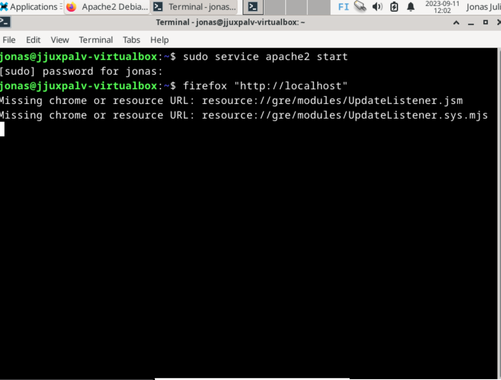
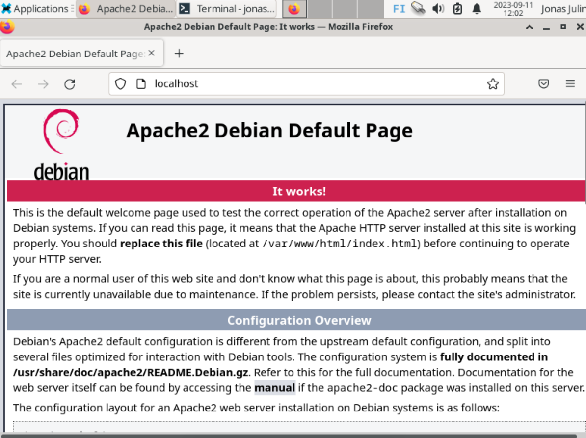
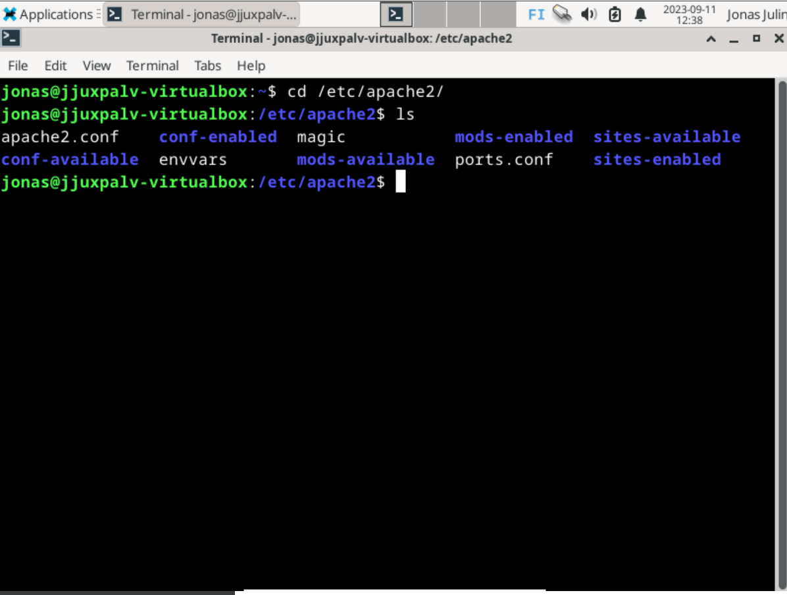
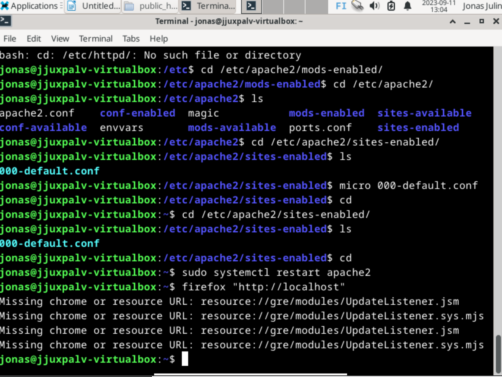
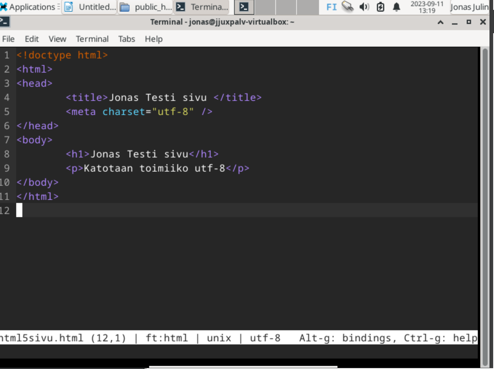
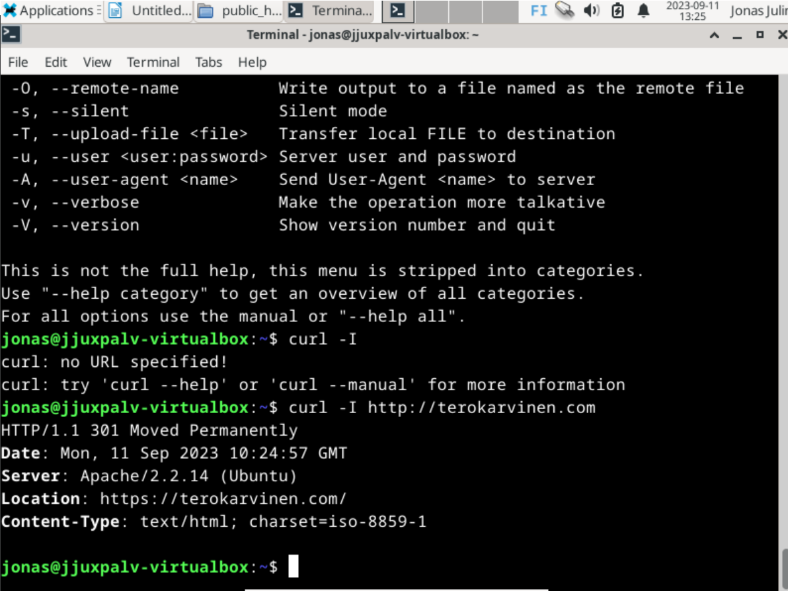

# h3 - Linux Palvelimet

## x) Artikkelin tiivistelmä

- Artikkelin teema on apache web serverin asennus ubuntulle
- Artikkelissa on kommennot asentamiseen, palvelimen toimivuuden testaamiseen ja pääsivun vaihtamiseen omiin sivuihin

Lähde: https://terokarvinen.com/2008/05/02/install-apache-web-server-on-ubuntu-4/

## a) Apache 2 asennus ja testaus

Apache 2 tuli asennettua viime tunnin aikana, joten asentamisesta en voi tällä hetkellä ottaa omaa kuvankaappausta  
Testataan kuitenkin että palvelin on päällä ja toimii:

Ja testaus:

## b) Loki

En ihan ymmärtänyt mikä loki kyseessä, koitin katsella syslogia mutta en luule että löysin oikeaa.

Lähde: https://www.linuxfoundation.org/blog/blog/classic-sysadmin-viewing-linux-logs-from-the-command-line

## c) Apache palvelimen sivun vaihto

Vaihdetaan apache palvelimen etusivu muuhun.

Koitin eri asioita googlettamalla, mutta en ihan ymmärtänyt teinkö asiat oikein vai väärin. Vaatii lisäkatselua.

Lähde: https://askubuntu.com/questions/857609/apache2-now-pointing-to-new-default-page

## d) Käyttäjäsivut

En ihan ymmärtänyt mitä haettiin. Jätän väliin.

## e) HTML 5 Sivu

Koska en saanut aikasempia kohtia menemään, otin vain kuvankaappauksen koodista jonka kirjoitin microlla.

Lähde:  https://terokarvinen.com/2012/short-html5-page/

## f) Curl komennot

Curl komennolla voidaan siirtää dataa palvelimelta tai palvelimeen eri protokollien avulla.

Curl-I antaa näemmä nettisivun osoitteen tietoja, kuten ajan (palvelimen näemmä, koska eri aika kuin itsellä),
palvelin alusta millä pyörii jne.

Lähde: https://www.geeksforgeeks.org/curl-command-in-linux-with-examples/
