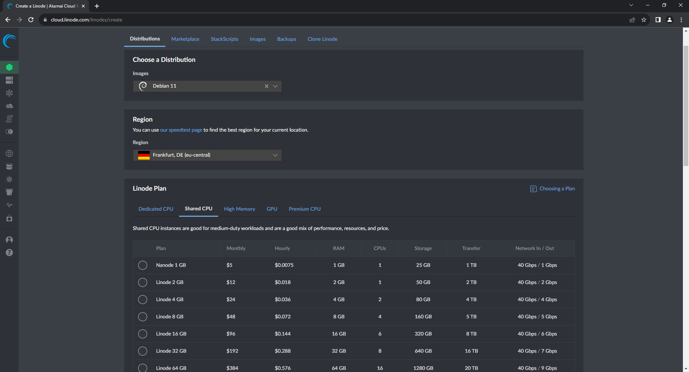

# h4 - Linux Palvelimet 

## x) Artikkelin tiivistelmä

- Artikkeli antaa katsauksen siitä mitä uusien virtuaali palvelimien kanssa kannattaa tehdä ensin
- Artikkeli muistuttaa useaan otteeseen tekemään hyvän salasanan palvelimeen
- Artikkeli käy step-by-step tyylillä mm. palomuurin, sudo käyttäjän ja root käyttäjän lukitsemisen

## a) Vuokrataan pilveä :^)

Päätin käyttää samaa palvelua kuin mitä käytettiin tunnilla, eli Linodea

Valitsin samoja kuin mitä tunnilla otettiin, eli Debian ja Frankfurtista otettiin region, ja valitsin halvimman eli Nanode 1GB (valintaa ei näy vielä)

## b) Alkutoimet ennen kuin SNAFU

Uusi palvelin tarvitsee suojatoimia, joten pitää asentaa palomuuri, lisätä uusi oma käyttäjä, ja suljetaan root käyttäjä poiskäytöstä.

Laitetaan virtuaalipalvelin päälle, ja kirjaudutaan virtuaalikoneella root-tunnuksella:
- ssh root@ip-osoite ja sen jälkeen HYVÄ salasana minkä laittaa palvelinta tehdessä

Aina ensin asennettaan kaikki uudet päivitykset komennoilla sudo apt-get update ja sudo apt-get upgrade.
Asennetaan sitten palomuuri komennolla sudo apt-get install ufw:

Jotta SSH-yhteys ei katkea, pitää tehdä myös reikä SSH:lle palomuuriin komennolla sudo ufw allow 22/tcp:

Reikä tehty, laitetaan palomuuri päälle ja katsotaan toimiiko homma. Palomuuri päälle: sudo ufw enable, palomuurin status: sudo ufw status:

Palomuuri on nyt käynnissä, joten seuraava osio, lisätään uusi käyttäjä. Tämä tehdään vielä SSH terminaalissa komennoilla "sudo adduser [nimi], sudo adduser [nimi] sudo". (Tästä en muistanut ottaa kuvankaappausta.)
Kirjaudutaan uudella terminaalilla, uudella käyttäjällä palvelimeen:

Katsotaan että sudo komennot toimivat uudella käyttäjällä:

Uusi käyttäjä toimii, joten lukitaan root-tunnus. Komento "sudo usermod --lock root" lukitsee salasanan käytön:

Sen jälkeen SSH yhteyden kautta otetaan Root sisäänkirjautumisen mahdollisuus pois. Komennolla "sudoedit /etc/ssh/sshd_config" avautuu tämä näkymä, ja vaihdetaan "PermitRootLogin" kohdassa "yes" -> "no":

Kaiken tämän jälkeen päivitettiin kaikki taas "sudo apt-get update" & "upgrade" komennoilla.

## c) Apache 2: Electric Boogaloo

Asennetaan Apache2 webpalvelin virtuaalipalvelimeen. Komento "sudo apt-get install apache2", ja palvelin pyörimään "sudo systemctl start apache2". 
Palvelin on päällä, mutta siihen ei saa yhteyttä koska siihen pitää tehdä myös reikä palomuuriin. Komento "sudo ufw allow 80/tcp" hoitaa asian:

Vaihdetaan apache2 pääsivu toiseen, käytetään komentoa putkella: "echo This is a test for me|sudo tee /var/www/html/index.html". Katsotaan että toimii julkisesti, toisella koneella ja kännykällä:

## d) Murtautujia netissä?

Avataan lokia, ja katsotaan onko jo muitakin yrittänyt tulla sisään. Katsoin esim. Apache 2 lokia komennolla "tail /var/log/apache/access.log", toisaalta ainoat IP-tunnarit mitkä tuli vastaan olivat omia.

