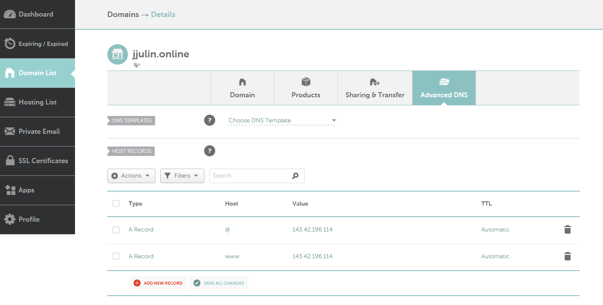
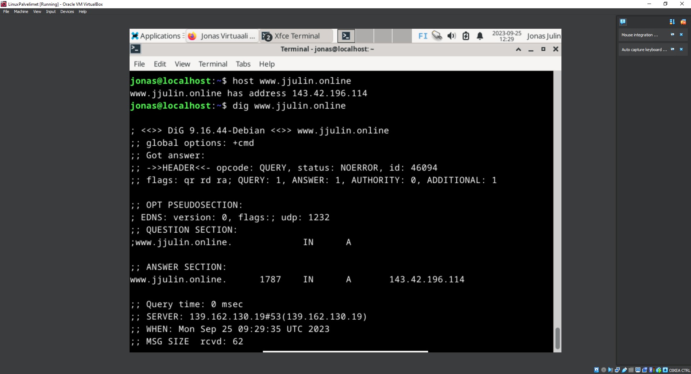
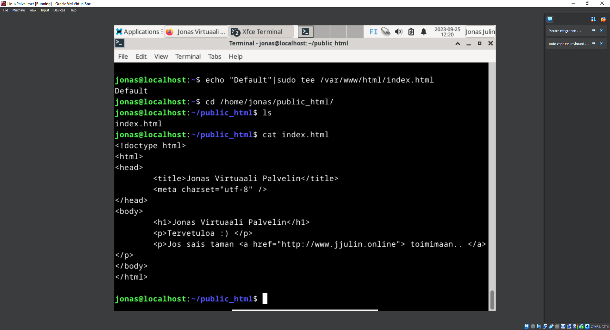
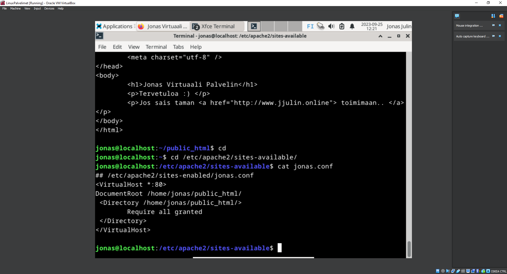
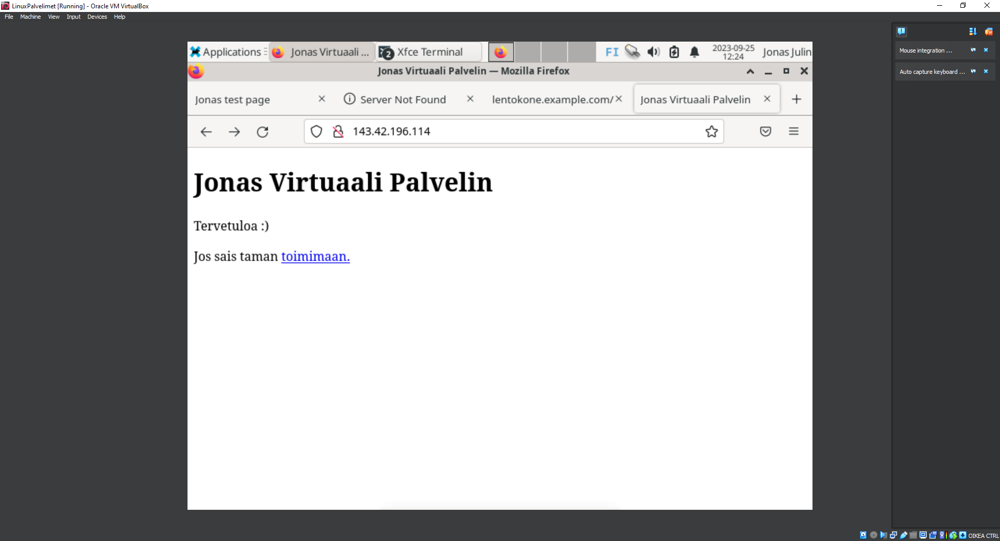
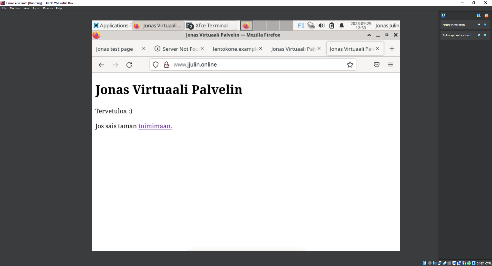
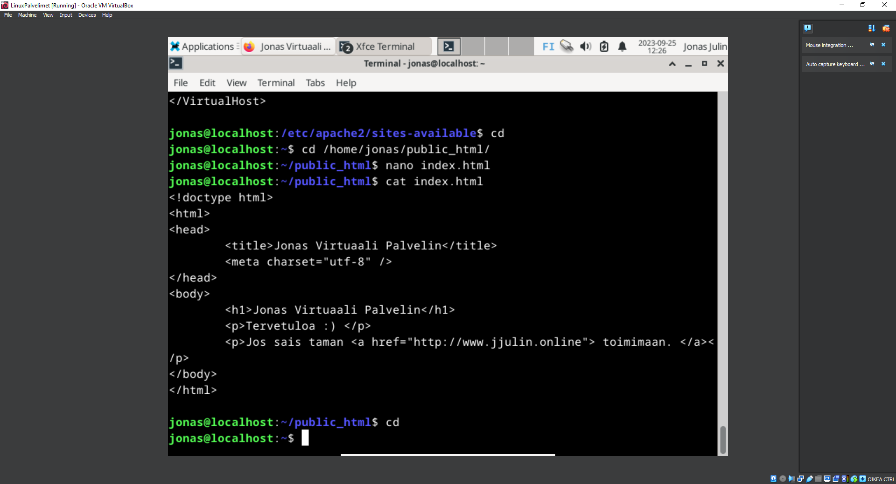

# h5 - Linux Palvelimet

## x) Artikkelien tiivistelmät

- Ensimmäinen artikkeli kertoo miten vaihdetaan Apache2 etusivu käyttämättä "~" tai käyttäjänimeä. Artikkelissa on ohjeet uuden .conf tiedoston tekemiseen ja miten ne vaihdetaan "defaultien" kanssa.
- Toinen artikkeli kertoo miten saadaan samalle ip-osoitteelle eri sivuja näkymään. Lopussa vielä miten simuloidaan nimipalveluja.
- Kolmas artikkeli menee hieman tiiviimmin asiaan, miten ja milloin käytetään "name-based virtual hosts", ja ohjeita niiden käyttöön.

## a) Vuokrataan nimi In nomine Patris et Filii et Spiritus Sancti

Tunnilla käytettiin NameCheap.comia, joten päätin sieltä myös ottaa itselleni nimen. Ostin nimen "jjulin.online" koska se oli halvin mahdollinen tähän hätään.
Vaihdoin dns asetuksissa tarvittavat hostit oman palvelimen ip-osoitteeseen.

## b) Dig this host

Muistakaa aina alussa, kun laitetaan virtuaalikoneita/palvelimia päälle, "sudo apt-get update" ja "sudo apt-get upgrade"

Katsotaas mitä löydetään komennoilla "host" ja "dig". Ensin ei löytynyt palvelimelta "dig" komentoa, joten se piti aluksi asentaa -> "sudo apt install dnsutils".
Asennuksen jälkeen komennot "host www.jjulin.online" ja "dig www.jjulin.online"

"host" komento antaa syötteen, joka kertoo haetun sivun ip-osoitteen.
"dig" komento antaa hieman enemmän informaatiota, vaikkakin myös saman, eli sivun ip-osoitteen. Numeroa "1787" en oikein ymmärrä ihan mihin vittaa. 

## c) Mun sivut on cool

Vaihdetaan palvelimen etusivu omaksi. Tehdään ensin uusi kansio kotihakemistoon. 
Käytetään komentoa "mkdir public_html" että saadaan kansio luotua -> /home/jonas/public_html/"
Siirrytään kansion sisään "cd public_html/" komennolla.
Tehdäänpä sitten uusi sivu! "nano index.html" komento. 

Jotta saataisiin tämä sivu näkymään sitten palvelimella, pitää tehdä uusi .conf tiedosto apachen omiin kansioihin.
Käytetään komentoa "sudoedit /etc/apache2/sites-available/jonas.conf". Nano aukeaa, ja syötetään nämä tiedot sisään:

Tämän jälkeen pitää saada tämä uusi .conf tiedosto toimimaan, ja vanha suljettua, joten komennot
- "sudo a2ensite jonas.conf"
- "sudo a2dissite 000-default.conf"
Jonka jälkeen sitten terminaali kertoo että saadakseen muutokset toimintoon, pitää apache palvelu uudelleen käynnistää.
Käytetään komentoa "sudo service apache2 restart".

Aluksi en tahtonut saamaan näkymiin sivuja, kunnes tajusin että yksi komento jäi puuttumaan
- "echo "Default"|sudo tee /var/www/html/index.html"

Ja koitin sitten selaimella ensin IP-osoitteella:

Ja sitten www.jjulin.online

Saatiin toimimaan :)

Tässä vielä kuva myös että olen nanolla muokannut sivua, enkä tarvinnut sudoa käyttää:

