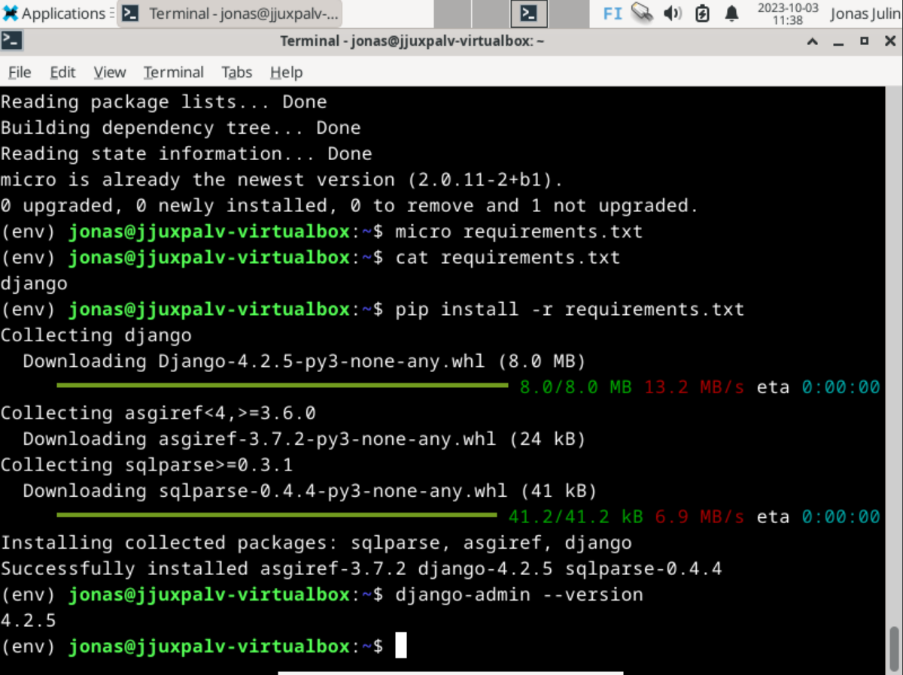
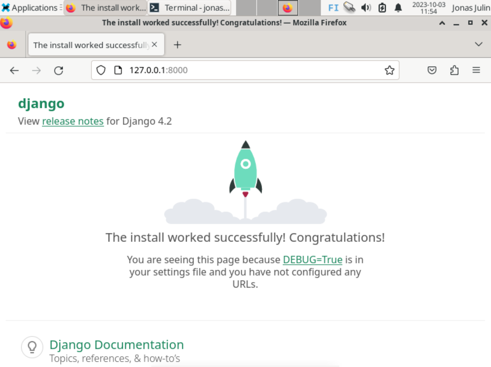
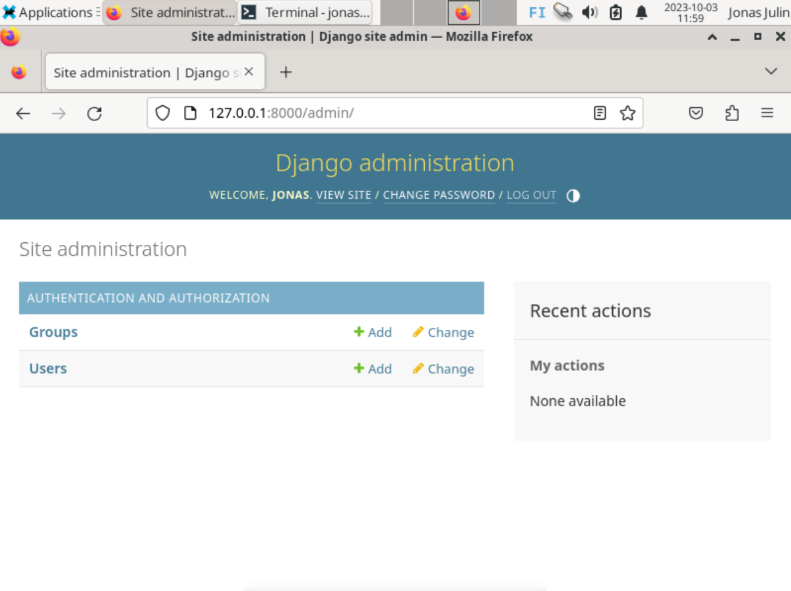
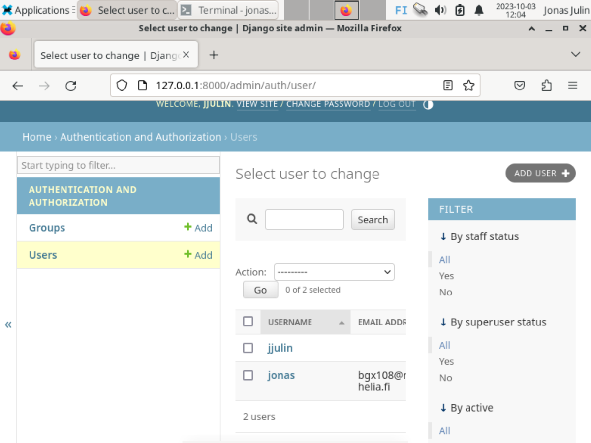

# h6 - Linux Palvelimet

## x) Artikkelien tiivistelmät

Ensimmäinen artikkeli

- python tekniikasta
- mitä hyötyjä djangosta on weppipalvelun alustana

Toinen artikkeli

- ohjeet djangon asennukseen ja sen käyttöönottoon
- koodi asiakasrekisterin tekemiseen esimerkkinä

Kolmas artikkeli

- Django 4 tuotanto webbipalvelun asennus
- ohjeita djangon asennukseen apachella
- erinäisiä vianmäärityksiä ja niihin vastauksia

## a) Django, Django, have you always been alone?

Käytin artikkelien ohjeita asentaakseni Djangon ja kehitysympäristön.
Aluksi siis "sudo apt-get update" ja "sudo apt-get upgrade" päivityksiin, ja sitten komento : "sudo apt-get -y install virtualenv".

Tämän jälkeen komento virtuaaliympäristön luomiseen: "$ virtualenv --system-site-packages -p python3 env/", ja aktivoidaan se komennolla "source env/bin/activate". Tarkistetaan että ollaan virtuaaliympäristössä komennolla "which pip".

Tehdään tiedosto jossa lukee mitä asennetaan "pip" komennolla, eli requirements.txt.
Käytetään komentoa "pip install -r requirements.txt" ja sen jälkeen tarkistetaan että käytössä djangon uusin versio komennolla "django-admin --version"

Katsotaan asennettiinko kaikki oikein! Tehdään uusi projekti (käytin kaikkea artikkelista kun tehtävän anto antoi luvan : https://terokarvinen.com/2022/django-instant-crm-tutorial/)
Komento "django-admin startproject teroco" aloittaa projektin.
Vaihdetaan directorya, uuteen projektiin, "cd teroco".
Uusi komento käynnistämään kehityspalvelimen, "./manage.py runserver". Palvelimen ollessa päällä, avataan selain ja käydään osoitteessa http://127.0.0.1:8000/.
Kaiken järjen mukaan asennus toimii!

## b) Your Database are belong to us
Jatketaan tutoriaaliartikkelin seuraavasta osiosta, ja koitetaan päästä admin sivuille.
Koska ei ole käyttäjiä eikä salasanaa ne pitää siis tehdä.
Ensiksi päivitetään tietokannat komennoilla. Laitetaan palvelin pois päältä siksi aikaa CTRL+C:llä.
Kommennot siis: "./manage.py makemigrations" ja "./manage.py migrate".

Tehdään uusi käyttäjä ja salasana. Salasanan tekemiseen voidaan asentaa password generator komennolla "sudo apt-get install pwgen".
Komennolla "pwgen -s 20 1" tehdään randomisaatiolla uusi salasana.
Sitten, käyttäjän teko komennolla "./manage.py createsuperuser".
Tiedot kenttiin, ja katsotaan päästäänkö admin sivuille:

Ja kyllä vain!

Lisätään käyttäjä admin sivuilla.

## WIP, TO BE CONTINUED
