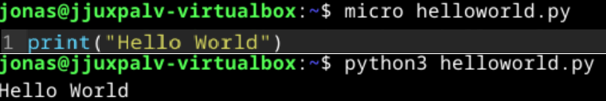
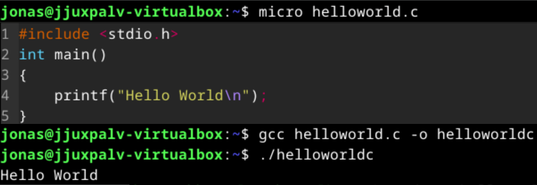
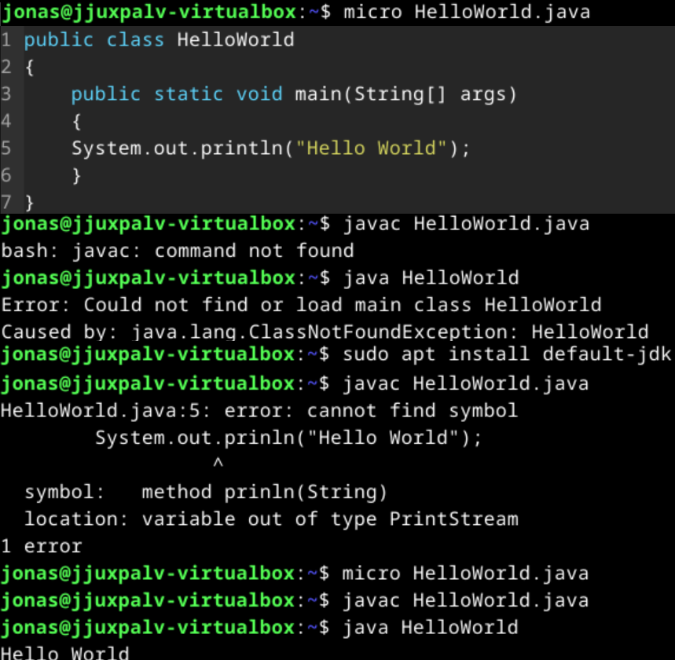
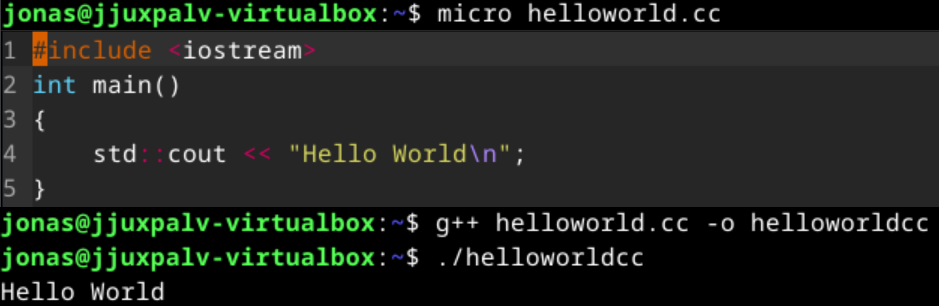
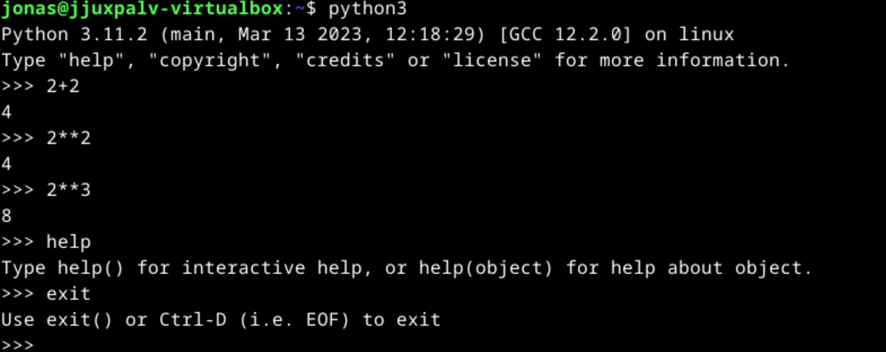
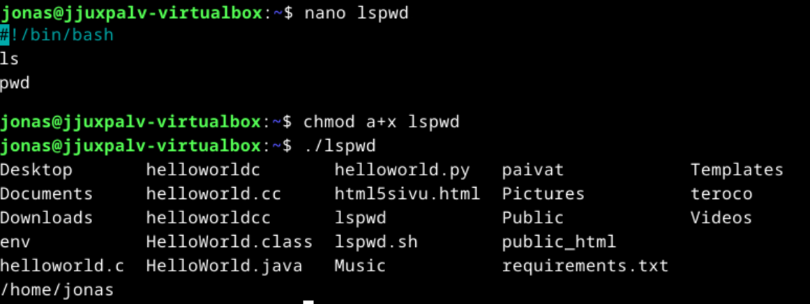

## h7 - Linux Palvelimet

# x) Läksylinkit
- [h1] (https://jonzsa92.github.io/linuxpalvelimet/h1)
- [h2] (https://jonzsa92.github.io/linuxpalvelimet/h2)
- [h3] (https://jonzsa92.github.io/linuxpalvelimet/h3)
- [h4] (https://jonzsa92.github.io/linuxpalvelimet/h4)
- [h5] (https://jonzsa92.github.io/linuxpalvelimet/h5)
- [h6] (https://jonzsa92.github.io/linuxpalvelimet/h6)
- [h7] (https://jonzsa92.github.io/linuxpalvelimet/h7)

# y) Tiivistelmät
Artikkeli: https://terokarvinen.com/2018/hello-python3-bash-c-c-go-lua-ruby-java-programming-languages-on-ubuntu-18-04/
- Artikkeli käsittelee "Hello World"-koodipätkiä eri kielillä.
- Hello World on koodipätkä jolla testataan että koodi toimii, kielellä kuin kielellä.

# a) Koodikielet

Tässä kolme kuvakaappausta "Hei maailma" koodipätkästä Pythonillä, C:llä ja Javalla.
Javan kanssa tuli hieman ongelmia, koska en ollut asentanut tarvittavia asioita. Asia kuitenkin luonnistui jälkeenpäin.
Oli myös hieman kirjoitusvirheitä koodissa, jonka korjasin sen jälkeen kun ei lähtenyt käyntiin.

Python:

C:

Java:

# b) Extra kieli

Tässä kuvakaappaus "Hei maailma" koodipätkästä C++:lla

# c) Python laskin

Pythonin interaktiiviseen laskimeen pääsee komennolla "python3". Sillä voi suorittaa kaikennäköisiä laskinasioita kuten summa, kertolasku ja potenssi

# d) Shellscript

Tein simppelin shellscriptin käyttämällä tätä lähteenä: https://terokarvinen.com/2007/shell-scripting-4/

Simppeli scripti tekee yhdellä komennolla komennot "ls" ja "pwd"

# e) Uusi komento

En ihan ymmärtänyt miten vaihdetaan käyttäjää terminaalissa sen jälkeen, kun uuden on luonut.

# f) WIP - En ehtinyt kaikkea
